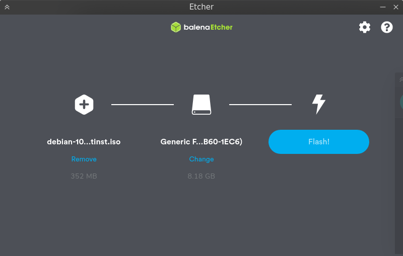
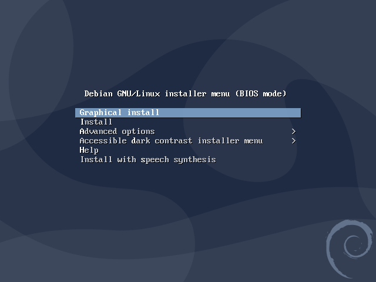
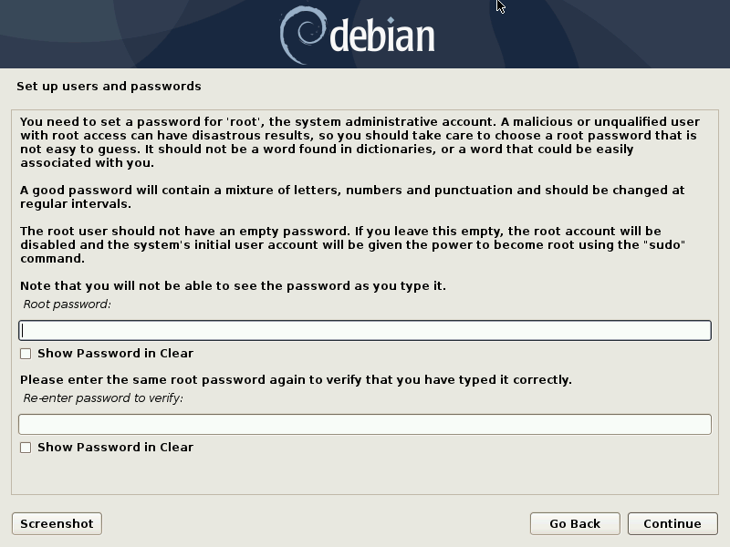
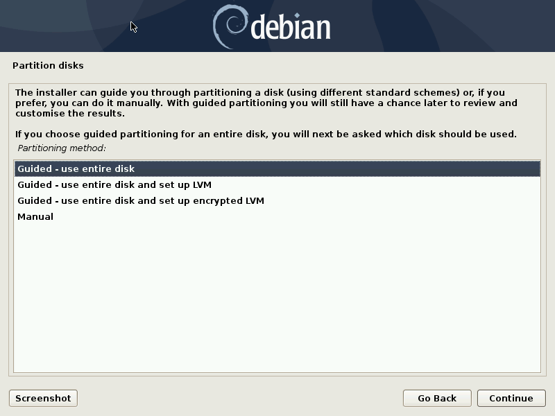
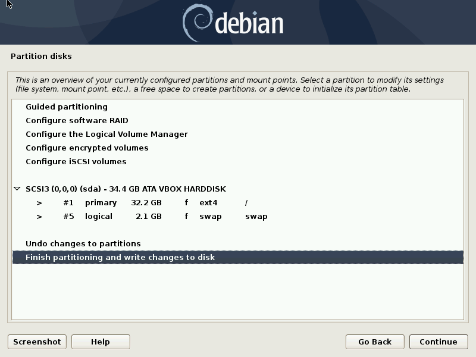
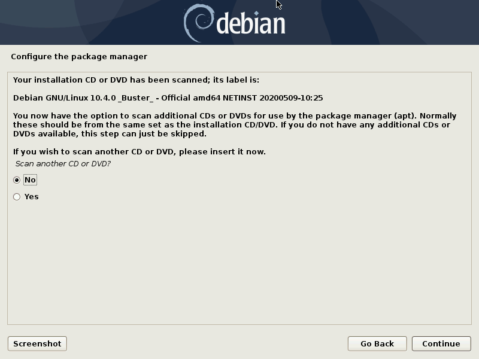
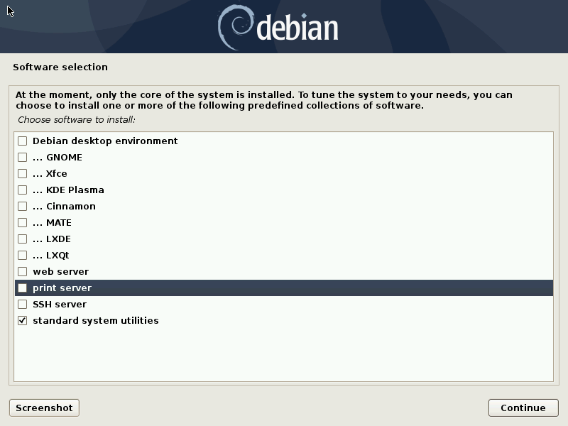
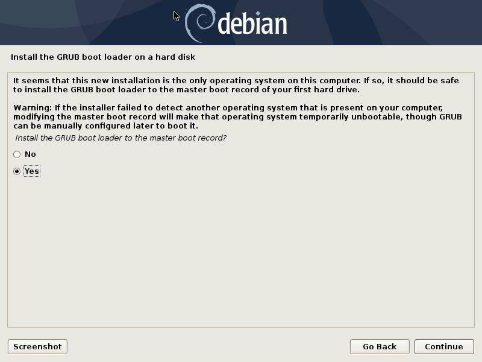
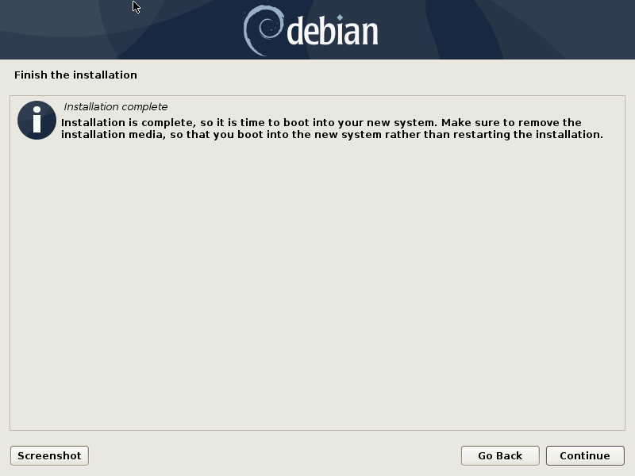

# Installing debian
As you probably already figured out from this tutorial's title, we are going to be using linux as the primary os for this tutorial. Debian is a well tested, stable distribution with the level of customizability, whilst not being as technically oriented as something like arch linux.

## Preparing for install
Debian provides a number of [install files](https://www.debian.org/distrib/) suited for different setups. I strongly recommend downloading the [netinstall iso](https://cdimage.debian.org/debian-cd/current/amd64/iso-cd/debian-10.4.0-amd64-netinst.iso). I will be using it for this process.

Next your will need a spare usb drive that you don't have any important information on. We will be flashing that usb with the netinstall iso. 

Install a program called [balenaEtcher](https://www.balena.io/etcher/). This program allows easier flashing to our usb drive. Select the netinstaller that you downloaded earlier and the usb drive you want to flash to. 

Then press flash and wait for the process to finish.

Plug the finished usb into the computer you want to set this up on and [boot to the usb](https://www.lifewire.com/how-to-boot-from-a-usb-device-2626091).

## Installation
Once you have booted into the live usb, there will be a screen like this.

Enter graphical install to begin with this install. Select your preferred language, location, and keyboard. At this point you will be greeted with a loading screen and maybe some network configs. Go through these and fill in the blanks.

Give your self a root password, a user account name and a password for that user. Select the appropriate time zone. 

Then you will be greeted with a partition screen. This is up to you with how you choice to handle this. If you want to dual boot with windows you can find many tutorials on the web. I would recommend just going with the `Guided - use entire disk` preset. 

> If you partition your disk with `Guided - use entire disk` or any of the other presets, you **will** lose all of your data. Make sure you dont have anything you want to keep on the computer and have a full backup before continuing 

Next select the hard drive you want to partition and the option `All files in one partition`. 

Finally you will be greeted with a confirm screen. Click continue, select yes then click continue and wait for the install process.

It will ask you if you want to add another cd or dvd. Select no and click continue.

Select your country for mirror locations. If you know of a mirror that is is fast for you, chose that one, otherwise stick with `deb.debian.org`. If your network doesn't need a proxy, just skip past it. Select no for the package survey. 

You will eventually get to an install customization screen. The only thing we need for this is standard system utilities. 

Click yes and continue on the usage of grub. Then you need to select the drive you partitioned before and click continue.

Finally you are done with the installation and you can continue on to setting up the GUI.

[Window manager setup →](./tutorial/wmSetup.md)
